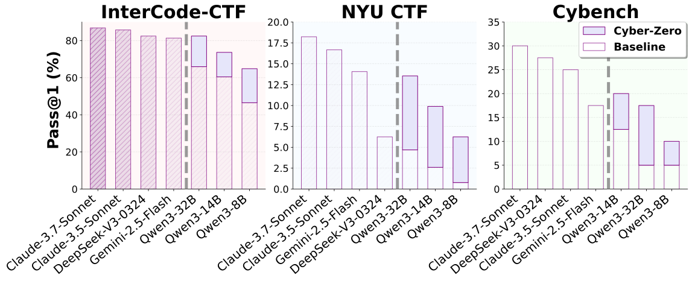

# Cyber-Zero: Training Cybersecurity Agents without Runtime

<p align="left">
    <a href="https://arxiv.org/abs/2508.00910">
</p>

<p align="left">
    🧐&nbsp;<a href="#overview">Overview</a>
    | 🚀&nbsp;<a href="#quick-start">Quick Start</a>
    | 🏗️&nbsp;<a href="#architecture">Architecture</a>
    | ⚙️&nbsp;<a href="#configuration">Configuration</a>
    | 📊&nbsp;<a href="#generation">Generation</a>
    | 📝&nbsp;<a href="#validation">Validation</a>
    | 📝&nbsp;<a href="#cli-interface">CLI Interface</a>
    | 📝&nbsp;<a href="#citation">Citation</a>
</p>

Cyber-Zero is a comprehensive framework for training cybersecurity agents without requiring runtime execution environments.

## Overview

<p align="center">
    
</p>

Large Language Models (LLMs) have achieved remarkable success in software engineering tasks when trained with executable runtime environments, such environments are often unavailable in cybersecurity domains where challenge configurations and execution contexts are ephemeral or restricted. Cyber-Zero addresses this fundamental limitation by leveraging publicly available CTF writeups and employing persona-driven LLM simulation to reverse-engineer runtime behaviors and generate realistic, long-horizon interaction sequences without actual execution environments.

The key innovation is generating high-quality training trajectories through LLM simulation rather than requiring actual execution environments, making it scalable and practical for training cybersecurity agents. Using trajectories synthesized by Cyber-Zero, we train LLM-based agents that achieve up to **13.1% absolute performance gains** over baseline models on three prominent CTF benchmarks: InterCode-CTF, NYU CTF Bench, and Cybench.


## EnIGMA+

To facilitate the development of cybersecurity agents, we present **EnIGMA+**, an enhanced agent scaffolding of [EnIGMA](https://swe-agent.com/0.7/usage/enigma/) that runs hundreds of CTF challenges in _hours_ instead of _days_. EnIGMA+ is built on top of [SWE-agent](https://github.com/SWE-agent/SWE-agent).

Using EnIGMA+, our best model, **Cyber-Zero-32B**, establishes new state-of-the-art performance among open-weight models, matching the capabilities of proprietary systems like DeepSeek-V3-0324 and Claude-3.5-Sonnet while offering superior cost-effectiveness, demonstrating that runtime-free trajectory synthesis can effectively democratize the development of state-of-the-art cybersecurity agents.

For detailed information about EnIGMA+, including installation, configuration, and usage instructions, please check the [README in the enigma-plus folder](enigma-plus/README.md).


## Installation

### From Source

```bash
# Install dependencies
pip install -r requirements.txt

# Install the package
pip install -e .
```


## Quick Start

### Generate Trajectories

```bash
# Using the CLI
cyber-zero generate \
    --sampled_flags_path task_meta.jsonl \
    --output_path trajectories.jsonl \
    --trajectories_per_task 3 \
    --workers 16

# Using the direct script interface
python generate_trajectory.py \
    --sampled_flags_path task_meta.jsonl \
    --output_path trajectories.jsonl \
    --trajectories_per_task 3 \
    --workers 16
```

### Evaluate Quality

```bash
# Using the CLI
cyber-zero evaluate \
    --input_path trajectories.jsonl \
    --output_path quality_results.jsonl \
    --model_id deepseek-v3-0324

# Using the direct script interface  
python evaluate_quality.py \
    --input_path trajectories.jsonl \
    --output_path quality_results.jsonl \
    --model_id deepseek-v3-0324
```

### Reformat Trajectories

```bash
# Using the CLI
cyber-zero reformat \
    --input_path quality_results.jsonl \
    --output_path formatted_trajectories.jsonl \
    --split_output

# Using the direct script interface
python reformat_trajectories.py \
    --input_path quality_results.jsonl \
    --output_path formatted_trajectories.jsonl \
    --split_output
```

## Architecture

The framework follows a modular architecture of Cyber-Zero:

```
cyber_zero/
├── __init__.py                 # Package initialization
├── config.py                   # Configuration management
├── models.py                   # Data models (TaskMeta, TrajectoryData, etc.)
├── utils.py                    # Common utilities
├── validation.py               # Response and command validation
├── llm_client.py               # LLM interaction and quality evaluation
├── trajectory_generator.py     # Main trajectory generation logic
├── quality_evaluator.py        # Quality evaluation for trajectories
├── trajectory_reformatter.py   # Trajectory reformatting for training
├── cli.py                      # Command-line interface
├── prompts/                    # System prompts
│   ├── __init__.py
│   ├── assistant_turn_prompt.txt   # Assistant (CTF player) prompt
│   └── user_turn_prompt.txt        # User (system/environment) prompt
└── data_collection/            # Data collection utilities
    ├── __init__.py             # Package initialization
    ├── config.py               # Data collection configuration
    ├── scraper.py              # Shared web scraping utilities
    └── README.md               # Data collection documentation
```

### Key Components

- **Config**: Centralized configuration management with model mappings and validation rules
- **Models**: Type-safe data structures for tasks, trajectories, and evaluation results
- **Validation**: Comprehensive validation of responses, commands, and action formats
- **LLMClient**: Abstracted interface for different language models with retry logic
- **TrajectoryGenerator**: Main orchestrator for conversation generation
- **CLI**: User-friendly command-line interface

## Configuration

The framework uses a hierarchical configuration system with centralized model management:

### Basic Configuration

```python
from cyber_zero import Config

config = Config()
config.MAX_TURNS = 60  # Maximum conversation turns (30 paired turns)
config.DEFAULT_WORKERS = 16  # Number of parallel workers
```

### Model Configuration

The framework supports multiple LLM providers through `litellm`. The default model is **DeepSeek-V3-0324** as specified in the research paper:

```python
# Get available models
from cyber_zero.config import Config
config = Config()
print(config.models.MODEL_MAPPINGS)
# {'deepseek-v3-0324': 'deepseek-ai/DeepSeek-V3-0324', ...}

# Use a specific model
model_id = config.models.get_model_id("deepseek-v3-0324")
```

### Adding Custom Models

To add custom models for trajectory generation, update the model mappings in `cyber_zero/config.py`:

```python
# In cyber_zero/config.py
@dataclass
class ModelConfig:
    def __post_init__(self):
        if self.MODEL_MAPPINGS is None:
            self.MODEL_MAPPINGS = {
                # Default research model
                "deepseek-v3-0324": "deepseek-ai/DeepSeek-V3-0324",
                # Add your custom models here
                "custom-model": "provider/your-custom-model-id",
                "local-model": "http://localhost:8000/v1/completions",
            }
```

### Model Parameters

The framework uses research-validated parameters for optimal trajectory generation:

- **Temperature**: 0.6 (balanced creativity and consistency)
- **Top-p**: 0.95 (diverse but focused sampling)
- **Max Turns**: 30 paired turns (60 total turns)
- **Trajectories per Task**: 3 (for diversity)

## Generation

### TaskMeta
Represents CTF task metadata:
```python
task = TaskMeta(
    task_name="Buffer Overflow Basic",
    task_tag="pwn",
    task_points="100",
    task_description="Find the vulnerability...",
    solution="flag{example}",
    # ... other fields
)
```

### TrajectoryData
Complete trajectory with conversation history:
```python
trajectory = TrajectoryData(
    task_name="Example Task",
    trajectory=[
        ConversationTurn(role="user", content="ls -la"),
        ConversationTurn(role="assistant", content="```bash\nls -la\n```"),
        # ... more turns
    ],
    # ... other fields
)
```

## Validation

The framework includes comprehensive validation mechanisms to ensure trajectory quality:

### Response Validation
- **Command Format**: Validates proper command syntax and structure
- **Action Consistency**: Ensures actions are appropriate for the current context
- **Output Parsing**: Validates command outputs and responses

### Quality Assessment
- **Trajectory Completeness**: Checks for proper conversation flow
- **Solution Accuracy**: Validates that trajectories lead to correct solutions
- **Realism**: Ensures generated trajectories mimic real CTF solving patterns

### Validation Rules
```python
from cyber_zero.validation import validate_trajectory

# Validate a complete trajectory
is_valid = validate_trajectory(trajectory_data)
if is_valid:
    print("Trajectory passes validation")
else:
    print("Trajectory requires review")
```

## CLI Interface

### Unified CLI Commands
```bash
# Generate trajectories
cyber-zero generate --sampled_flags_path data.jsonl --output_path trajectories.jsonl

# Evaluate quality
cyber-zero evaluate --input_path trajectories.jsonl --output_path quality_results.jsonl

# Reformat for training
cyber-zero reformat --input_path quality_results.jsonl --output_path formatted.jsonl
```

### Direct Script Interface
All original CLI interfaces are maintained for backward compatibility:
- `python sync_task_metadata.py` - Sync task meta data from the web
- `python generate_trajectory.py` - Main trajectory generation
- `python evaluate_quality.py` - Quality evaluation  
- `python reformat_trajectories.py` - Trajectory reformatting

### CLI Options
```bash
# Generate with custom parameters
cyber-zero generate \
    --sampled_flags_path task_meta.jsonl \
    --output_path trajectories.jsonl \
    --trajectories_per_task 5 \
    --workers 32 \
    --model_id deepseek-v3-0324

# Evaluate with specific model
cyber-zero evaluate \
    --input_path trajectories.jsonl \
    --output_path quality_results.jsonl \
    --model_id claude-3-sonnet-20240229

# Reformat with split output
cyber-zero reformat \
    --input_path quality_results.jsonl \
    --output_path formatted_trajectories.jsonl \
    --split_output \
    --train_ratio 0.9
```

## Citation

If you use this benchmark suite in your research, please cite:

```bibtex
@article{zhuo2025cyber,
  title={Cyber-Zero: Training Cybersecurity Agents without Runtime},
  author={Zhuo, Terry Yue and Wang, Dingmin and Ding, Hantian and Kumar, Varun and Wang, Zijian},
  journal={arXiv preprint arXiv:2508.00910},
  year={2025},
}
```

## License

This project is licensed under the CC-BY-NC-4.0 - see the [LICENSE](LICENSE) file for details.

## Contributing

We welcome contributions! Please see [CONTRIBUTING.md](CONTRIBUTING.md) for guidelines on how to contribute to this project.

## Support

If you need help or have questions, please check our [SUPPORT.md](SUPPORT.md) guide or open an issue on GitHub.

## Code of Conduct

This project adheres to the Contributor Covenant Code of Conduct. Please read [CODE_OF_CONDUCT.md](CODE_OF_CONDUCT.md) for details.